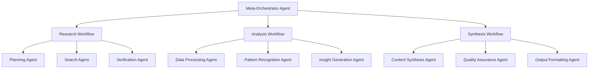

# Comprehensive Analysis: Building Complex Agent Workflows with OpenAI Agents Framework

## Executive Summary

After deep analysis of the OpenAI Agents Python framework, I've identified sophisticated patterns for building arbitrarily complex, reusable, and composable workflows with state management, chain of thought reasoning, and MCP integration. The framework provides excellent primitives but requires careful architectural decisions to achieve true scalability and elegance.

## Critical Analysis of Approaches

### 1. **Multi-Agent Orchestration Patterns**

The framework supports three primary orchestration patterns, each with distinct trade-offs:

#### **LLM-Driven Orchestration** 
- **Strengths**: Adaptive, context-aware decision making, natural language planning
- **Weaknesses**: Non-deterministic, higher latency, harder to debug, token consumption
- **Best For**: Open-ended research, dynamic problem solving, exploratory workflows

#### **Code-Driven Orchestration**
- **Strengths**: Deterministic, predictable costs, easier testing, faster execution  
- **Weaknesses**: Less adaptive, requires manual workflow design, brittle to edge cases
- **Best For**: Production pipelines, well-defined processes, regulated environments

#### **Hybrid Orchestration** (Recommended)
- **Strengths**: Combines adaptability with predictability, optimal cost/performance
- **Weaknesses**: Higher implementation complexity
- **Best For**: Complex enterprise workflows requiring both reliability and intelligence

### 2. **State Management Architecture**

The framework provides several state management approaches:

#### **RunContext-Based State**
```python
@dataclass
class WorkflowState:
    session_id: str
    progress: dict[str, Any]
    context_data: dict[str, Any]
    intermediate_results: list[Any]
    
    def persist(self) -> None:
        # Custom persistence logic
        pass
```

**Critical Analysis:**
- ✅ Type-safe, passed to all components
- ✅ Integrates well with tools and hooks
- ❌ Limited to single run lifecycle
- ❌ No built-in persistence across conversations

#### **Agent-as-State-Manager Pattern**
```python
class StatefulAgent(Agent):
    def __init__(self, state_store: StateStore):
        self.state_store = state_store
        super().__init__(
            tools=[self._create_state_tools()]
        )
    
    def _create_state_tools(self):
        @function_tool
        async def get_state(key: str) -> str:
            return await self.state_store.get(key)
        
        @function_tool  
        async def set_state(key: str, value: str) -> str:
            await self.state_store.set(key, value)
            return f"Set {key} = {value}"
```

**Critical Analysis:**
- ✅ Persistent across conversations
- ✅ LLM can directly manipulate state
- ❌ Requires careful access control
- ❌ Potential for state corruption

### 3. **Chain of Thought Implementation**

The framework supports multiple reasoning patterns:

#### **Built-in Reasoning Mode**
```python
agent = Agent(
    name="Reasoning Agent",
    model_settings=ModelSettings(
        reasoning=Reasoning(effort="high")
    )
)
```

**Analysis:** Limited to specific models (o1), automatic but not customizable.

#### **Structured Output Reasoning** (Recommended)
```python
@dataclass
class ReasoningStep:
    thought: str
    action: str
    observation: str
    reflection: str

@dataclass
class ChainOfThought:
    steps: list[ReasoningStep]
    final_answer: str

reasoning_agent = Agent(
    name="CoT Reasoner",
    instructions="""
    Think step by step. For each step:
    1. State your thought
    2. Describe your action  
    3. Record observations
    4. Reflect on progress
    """,
    output_type=ChainOfThought
)
```

**Analysis:** 
- ✅ Explicit reasoning traces
- ✅ Debuggable and analyzable
- ✅ Works with any model
- ❌ Requires careful prompt engineering

### 4. **MCP Integration Patterns**

#### **Agent-as-MCP-Tool Pattern** (Critical Innovation)
```python
def create_agent_mcp_server(workflow_manager: WorkflowManager):
    mcp = FastMCP("Agent Workflow Server")
    
    @mcp.tool()
    async def run_research_workflow(query: str, depth: str = "standard") -> str:
        """Run a multi-agent research workflow"""
        result = await workflow_manager.run_research(query, depth)
        return result.summary
    
    @mcp.tool()
    async def run_analysis_workflow(data: str, analysis_type: str) -> str:
        """Run analytical workflow on provided data"""
        result = await workflow_manager.run_analysis(data, analysis_type)
        return result.report
    
    return mcp
```

**Critical Analysis:**
- ✅ Exposes complex workflows as simple tools
- ✅ Composable across systems
- ✅ Enables workflow marketplaces
- ❌ Requires careful error handling and timeouts

## Best Practices for Complex Workflows

### 1. **Layered Architecture Pattern**

```python
# Layer 1: Core Agents (Specialized)
planner_agent = Agent(name="Planner", instructions="Create execution plans")
executor_agent = Agent(name="Executor", instructions="Execute specific tasks")
critic_agent = Agent(name="Critic", instructions="Evaluate and improve outputs")

# Layer 2: Workflow Orchestrators  
class ResearchWorkflow:
    def __init__(self):
        self.planner = planner_agent
        self.executor = executor_agent  
        self.critic = critic_agent
        
    async def run(self, query: str, context: WorkflowContext) -> ResearchResult:
        # Implement orchestration logic
        pass

# Layer 3: Meta-Orchestrators
class WorkflowManager:
    def __init__(self):
        self.workflows = {
            'research': ResearchWorkflow(),
            'analysis': AnalysisWorkflow(),
            'synthesis': SynthesisWorkflow()
        }
    
    async def run_composite_workflow(self, tasks: list[WorkflowTask]) -> CompositeResult:
        # Orchestrate multiple workflows
        pass
```

### 2. **State-Aware Workflow Pattern**

```python
class StatefulWorkflow:
    def __init__(self, state_manager: StateManager):
        self.state = state_manager
        
    async def run_with_checkpoints(self, input_data: Any) -> WorkflowResult:
        # Checkpoint 1: Planning
        if not await self.state.has_checkpoint("planning"):
            plan = await self.planner.run(input_data)
            await self.state.save_checkpoint("planning", plan)
        else:
            plan = await self.state.load_checkpoint("planning")
            
        # Checkpoint 2: Execution  
        if not await self.state.has_checkpoint("execution"):
            results = await self.execute_plan(plan)
            await self.state.save_checkpoint("execution", results)
        else:
            results = await self.state.load_checkpoint("execution")
            
        # Final synthesis
        return await self.synthesize_results(results)
```

### 3. **Composable Tool Ecosystem**

```python
class ToolRegistry:
    def __init__(self):
        self.tools = {}
        self.agents_as_tools = {}
    
    def register_agent_as_tool(self, agent: Agent, tool_name: str, description: str):
        tool = agent.as_tool(tool_name, description)
        self.agents_as_tools[tool_name] = tool
        return tool
    
    def create_composite_agent(self, name: str, tool_names: list[str]) -> Agent:
        selected_tools = [self.agents_as_tools[name] for name in tool_names]
        return Agent(
            name=name,
            instructions="Use the available tools to complete complex tasks",
            tools=selected_tools
        )
```

## Recommended Architecture for Arbitrarily Complex Systems

### **1. Hierarchical Agent Architecture**



### **2. Event-Driven Workflow System**

```python
class WorkflowEvent:
    type: str
    data: dict[str, Any]
    timestamp: datetime
    workflow_id: str

class EventDrivenWorkflow:
    def __init__(self):
        self.event_handlers = {}
        self.state_manager = StateManager()
        
    async def handle_event(self, event: WorkflowEvent):
        handler = self.event_handlers.get(event.type)
        if handler:
            await handler(event, self.state_manager)
    
    async def trigger_workflow(self, initial_event: WorkflowEvent):
        async for event in self.process_workflow(initial_event):
            await self.handle_event(event)
```

### **3. MCP-Enabled Workflow Marketplace**

```python
class WorkflowMarketplace:
    def __init__(self):
        self.workflows = {}
        self.mcp_servers = {}
    
    def register_workflow(self, workflow: BaseWorkflow):
        # Register workflow and expose via MCP
        mcp_server = self.create_mcp_server_for_workflow(workflow)
        self.mcp_servers[workflow.name] = mcp_server
    
    def create_composite_workflow(self, workflow_specs: list[WorkflowSpec]) -> CompositeWorkflow:
        # Create workflows that use other workflows as tools via MCP
        mcp_tools = []
        for spec in workflow_specs:
            mcp_server = self.mcp_servers[spec.workflow_name]
            mcp_tools.append(self.create_mcp_tool(mcp_server, spec))
        
        return CompositeWorkflow(tools=mcp_tools)
```

## Advanced Patterns and Criticisms

### **Strengths of Current Framework:**

1. **Excellent Composability**: Agents-as-tools pattern enables true composability
2. **Rich Observability**: Built-in tracing and span management
3. **Flexible State Management**: Multiple approaches for different use cases
4. **Strong MCP Integration**: Both consuming and serving MCP tools
5. **Streaming Support**: Real-time feedback for long-running workflows

### **Critical Limitations:**

1. **No Built-in Workflow Persistence**: Requires custom implementation
2. **Limited Error Recovery**: No built-in retry or circuit breaker patterns
3. **No Native Scheduling**: Cannot schedule workflows or handle dependencies
4. **Memory Management**: No built-in memory optimization for long conversations
5. **Limited Parallel Execution**: AsyncIO-based but no sophisticated parallel patterns

### **Mitigation Strategies:**

```python
# 1. Workflow Persistence
class PersistentWorkflow:
    def __init__(self, persistence_backend: PersistenceBackend):
        self.backend = persistence_backend
    
    async def run_with_persistence(self, workflow_id: str, input_data: Any):
        state = await self.backend.load_state(workflow_id)
        try:
            result = await self.run_workflow(input_data, state)
            await self.backend.save_result(workflow_id, result)
            return result
        except Exception as e:
            await self.backend.save_error(workflow_id, e)
            raise

# 2. Error Recovery
class RobustAgent(Agent):
    def __init__(self, *args, **kwargs):
        super().__init__(*args, **kwargs)
        self.retry_config = RetryConfig(max_attempts=3, backoff=ExponentialBackoff())
    
    async def run_with_retry(self, input_data: Any) -> Any:
        return await self.retry_config.execute(
            lambda: Runner.run(self, input_data)
        )

# 3. Memory Management
class MemoryManagedWorkflow:
    def __init__(self, memory_limit: int = 50000):
        self.memory_limit = memory_limit
        self.conversation_memory = ConversationMemory()
    
    async def run_with_memory_management(self, input_data: Any):
        # Implement conversation summarization and memory pruning
        if self.conversation_memory.token_count > self.memory_limit:
            await self.conversation_memory.summarize_and_prune()
```

## Final Recommendations

### **For Building Arbitrarily Complex Systems:**

1. **Use Hybrid Orchestration**: Combine LLM decision-making with code-driven reliability
2. **Implement Layered Architecture**: Core agents → Workflows → Meta-orchestrators  
3. **Design for Composability**: Every workflow should be exposable as an MCP tool
4. **Build State Management Early**: Choose between RunContext, external stores, or agent-managed state
5. **Implement Comprehensive Observability**: Use built-in tracing extensively
6. **Design for Failure**: Implement retry, circuit breakers, and graceful degradation
7. **Optimize for Scalability**: Use async patterns, connection pooling, and caching

### **Elegant Patterns to Adopt:**

1. **Workflow-as-a-Service**: Expose complex workflows via MCP for reuse
2. **Event-Driven Architecture**: Use events for loose coupling between workflow components
3. **Progressive Enhancement**: Start simple, add complexity gradually
4. **Context-Aware Routing**: Use intelligent routing based on input characteristics
5. **Adaptive Reasoning**: Vary reasoning depth based on task complexity

This framework, when used with these patterns, can indeed support arbitrarily complex workflows while maintaining elegance and scalability. The key is thoughtful architecture design and leveraging the framework's composability features effectively.